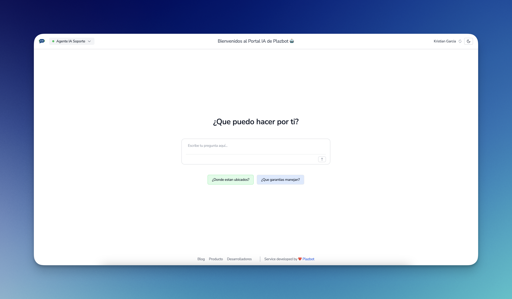

# Plazbot SDK Examples

AI Agents and WhatsApp integration for developers using the Plazbot SDK.

---

## Overview

This repository contains practical examples of the [Plazbot SDK](https://www.npmjs.com/package/plazbot), an easy-to-use developer toolkit for creating AI agents, portals, and integrations with messaging channels like WhatsApp or web widgets.

The SDK helps you create your AI agent and integrate it into any platform you need. The portal is a visible tool to show your clients a finished agent.

---

## Roadmap

- Sending WhatsApp messages
- Sending WhatsApp templates
- Recording webhooks for incoming WhatsApp messages
- Files for AI Agent
- APIs for AI Agent

---

## Installation

```bash
npm install plazbot
```

---

## Initialization

```ts
import { Agent, Portal } from 'plazbot';

const bot = new Agent({
  workspaceId: "[YOUR_WORKSPACE_ID]",
  apiKey: "[YOUR_API_KEY]",
  zone: "LA" // Use "EU" for Europe
});

const portal = new Portal({
  workspaceId: "[YOUR_WORKSPACE_ID]",
  apiKey: "[YOUR_API_KEY]",
  zone: "LA" // Use "EU" for Europe
});
```

---

## Agent Methods

### `addAgent({...})`
Creates a new agent with a given name, prompt, buffer, and optional branding details.

### `addExample({...})`
Adds a quick reply example to the agent. Maximum: 5.

### `clearExamples(agentId)`
Removes all examples associated with the specified agent.

### `getAgents()`
Returns all agents within the workspace.

### `getAgentById({ id })`
Fetches details of a specific agent by ID.

### `updateAgent({...})`
Updates agent settings like color, buffer, prompt, etc.

### `deleteAgent({ id })`
Deletes an agent and automatically removes its reference from any associated portals.

### `onMessage({ agentId, question })`
Sends a message to the AI agent and receives a streamed response.

---

## Portal Methods

### `addPortal({...})`
Creates a new portal with UI configuration (title, subtitle, branding, etc.).

### `getPortal(id)`
Fetches portal details by ID.

### `addAgentToPortal({ portalId, id })`
Links an existing agent to a portal.

### `addLinkToPortal({...})`
Adds an external link (e.g. "Blog") to the portal. Max 5 links allowed.

### `clearLinks(portalId)`
Removes all configured links from the portal.

### `updatePortal({...})`
Updates portal metadata (name, logo, branding).

### `deletePortal(id)`
Deletes the specified portal.

---

## Credentials

### Where to get your `API Key` and `Workspace ID`?

You can find both inside the [Plazbot Dashboard](https://www.plazbot.com) after login:

- Go to **Settings** > **API KEY**
- Copy your `API Key` and `Workspace ID`

---

## Visual Reference

Below are example screenshots of the Portal UI (light and dark mode):

### Portal


### Light Mode


### Dark Mode


---

## Documentation

For full API reference, visit:  
👉 [developers.plazbot.com](https://developers.plazbot.com/plazbot-developer-hub-749573m0)

---

## License

MIT License
